service mysql start

service mysql status


进入mysql：

```
mysql -u debian-sys-maint -p
faCUIbqtwdt7aurG
```

查看可用数据库

```
show databases;
```

创建数据库

```
create database test
```

使用数据库

```
use test;
```

导入数据库（当前目录下有create.sql，populate.sql）

```
source create.sql;
source populate.sql;
```

查看当前数据库的表

```
show tables;
```


creat table first_t1(id varchar(20),name varchar(50));创建表，id最大20字符

show create table first_t1;查看创建表的信息

desc first_t1;查看表的字段

insert into first_t1 values("001","yjz“);插入数据

select * from first_t1;查看表的数据

select * from first_t1 where id="001";

select * from first_t1 where name like "%j%" limit 2;查找匹配值·,2行

grant all on test_db.* to first@'localhost' identified by "123";本地可以使用first，密码123访问test_db数据库所有权限

grant select test_db.* to first@'localhost' identified by "123";本地可以使用first，密码123访问test_db数据库读权限

drop database dirst_db;删除数据库

show variables like "%char%";查看数据库字符集


### 第3章

使用test数据库:

```
use test;
```


可用数据库的一个列表:

```
show databases;
```

获得一个数据库内的表的列表:

```
show tables;
```

```
show columns from customers;
show status;用于显示广泛的服务器状态信息；
SHOW CREATE DATABASE和SHOW CREATE TABLE，分别用来显示创建特定数据库或表的MySQL语句；
SHOW GRANTS，用来显示授予用户（所有用户或特定用户）的安全权限；
SHOW ERRORS和SHOW WARNINGS， 用来显示服务器错误或警告消息。
```

### 第 4 章  

检索单个表列、多个表列以及所有表列  

```
show columns from products;
```

```
select prod_name from products;
```

```
select prod_id,prod_name,prod_price from products;
```

```
select * from products;
```

```
select vend_id from products;
```

```
select distinct vend_id from products;//不重复
```

```
select prod_name from products limit 5;//不多于5行
```

```
select prod_name from products limit 5,5;//从行5开始的5行
```

```
select products.prod_name from products;//完全限定的表名
select products.prod_name from test.products;
```

### 第５章  

排序检索出的数据  

```
select prod_name from products;//无序
```

```
select prod_name from products order by prod_name;//有序
```

```
select prod_id,prod_price,prod_name from products order by prod_price,prod_name;//按prod_price进行排序,prod_price相等，按prod_name排序
```

```
select prod_id,prod_price,prod_name from products order by prod_price desc;
//降序排序
```

```
select prod_id,prod_price,prod_name from products order by prod_price desc,prod_name;//按prod_price进行降序排序,prod_price相等，按prod_name降序排序
```

```
asc 升序
```

```
select prod_price from products order by prod_price desc limit 1;//找出一个列中最高
```

### 第６章  

使用SELECT语句的WHERE子句指定搜索条件。  

```
select prod_name,prod_price from products where prod_price=2.50
//查找prod_price=2.5
```

```
select prod_name,prod_price from products where prod_price=2.5 order by
prod_name desc;//查找并排序
```

```
select prod_name,prod_price from products where prod_name="fuses";
```

```
select prod_name,prod_price from products where prod_price<10;//范围
```

```
select prod_name,prod_price from products where vend_id <> 1003;
//列出不是由供应商1003制造的所有产品：  一样  !=1003
```

```
select prod_name,prod_price from products where prod_price between 5 and 10;
//检索价格在5美元和10美元之间的所有产品：
```

```
select prod_name,prod_price from products where prod_price is null;
检查具有NULL值的列
```

```
show columns from customers;
select cust_id from customers where cust_email is null;
```

### 第 7 章  

or and not in 使用

##### and

```
select prod_id,prod_price,prod_name from products where vend_id=1003 and prod_price<=10;
```

##### or

```
select prod_name,prod_price,vend_id from products where vend_id=1002 or vend_id=1003;//or 的使用
```

```
select prod_name,prod_price,vend_id from products where vend_id=1002 or vend_id=1003 and prod_price>=10; //and优先级高于or
```

```
select prod_name,prod_price,vend_id from products where (vend_id=1002 or vend_id=1003) and prod_price>=10;//使用括号
```

##### in

```
select prod_name,prod_price,vend_id from products where vend_id in (1002,1003) order by prod_name;//找出vend_id为1002和1003的数据
等价
select prod_name,prod_price,vend_id from products where vend_id=1002 or vend_id=1003 order by prod_name;
```

##### not

```
select prod_name,prod_price,vend_id from products where vend_id not in (1002,1003) order by prod_name;//找出vend_id不为1002和1003的数据
```

### 第 8 章  

通配符以及怎样使用like

%：任意字符任意数量

```
select prod_name,prod_price,vend_id from products where prod_name like "jet%";
```

```
select prod_name,prod_price,vend_id from products where prod_name like "%anvil%";
```

```
select prod_name,prod_price,vend_id from products where prod_name like "s%e";
```

_：任意字符，单个数量

```
select prod_id,prod_name from products where prod_name like "%t_n anvil";
```

### 第 9 章  

正则表达式  

```
select prod_name from products where prod_name regexp "1000" order by prod_name;
//regexp后所跟的东西作为正则表达式,匹配有1000的数据
```

```
select prod_name from products where prod_name regexp ".000" order by prod_name;
//.是正则表达式中表示任意一个字符
```

```
select prod_name from products where prod_name regexp "1000|2000" order by prod_name;// | 在正则表达式中有or的意思
```

```
select prod_name from products where prod_name regexp "[123] ton" order by prod_name;//[123]表示匹配1或2或3
等价
select prod_name from products where prod_name regexp "(1|2|3) ton" order by prod_name;
```

```
select prod_name from products where prod_name regexp "[^123] ton" order by prod_name;//[^123]却匹配除1 2 3字符外的任何东西
```

```
匹配数字0到9 [0123456789] 或 [0-9]
匹配字符a到z [a-z]
```

```
匹配特殊字符，必须用\\为前导。 \\-表示查找-， \\.表示查找.  
select prod_name from products where prod_name regexp "\\." order by prod_name;
```


```
select prod_name from products where prod_name regexp "\\([0-9] sticks?\\)" order by prod_name;//结果如下
```


```
select prod_name from products where prod_name regexp "[[:digit:]]{4}" order by prod_name;//结果如下
等价
select prod_name from products where prod_name regexp "[0-9][0-9][0-9][0-9]" order by prod_name;
```

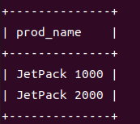

定位符

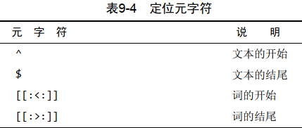

```
select prod_name from products where prod_name regexp "^[0-9\\.]" order by prod_name;//找出以一个数（包括以小数点开始的数）开始的所有产品
```

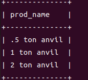

使REGEXP起类似LIKE的作用 本章前面说过， LIKE和REGEXP的不同在于， LIKE匹配整个串而REGEXP匹配子串。利用定位符，通过用^开始每个表达式，用$结束每个表达式，可以使REGEXP的作用与LIKE一样。  

### 第 10 章  

计算字段  


```
select concat(vend_name," (",vend_country,")") from vendors order by vend_name;
//把两个列拼接起来  concat()
```

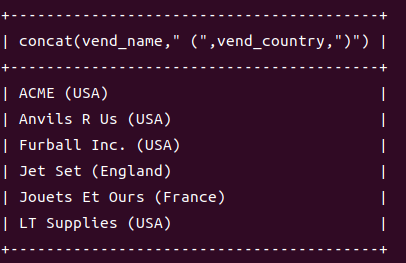

```
select concat(rtrim(vend_name)," (",vend_country,")") from vendors order by vend_name;
//rtrim() 删除数据右侧多余的空格来整理数据
```

```
select concat(rtrim(vend_name)," (",vend_country,")") as vend_title from vendors order by vend_name;//使用别名
```

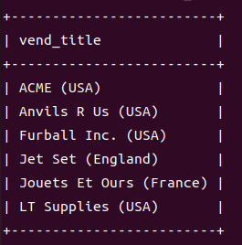

```
select prod_id,quantity,item_price,quantity*item_price as expanded_price from orderitems where order_num=20005;//进行算术计算
```

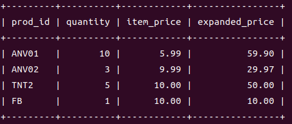

```
select now();//返回当前日期和时间
```

### 第 11 章  使用数据处理函数  

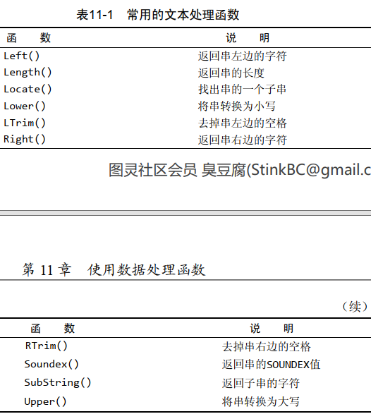

SOUNDEX是一个将任何文本串转换为描述其语音表示的字母数字模式的算法。 SOUNDEX考虑了类似
的发音字符和音节，使得能对串进行发音比较而不是字母比较  

```
select cust_name,cust_contact from customers where cust_contact="Y.Lie";//没搜到
```

```
select cust_name,cust_contact from customers where soundex(cust_contact)=soundex("Y.Lie");
```

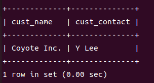

```
select vend_name,upper(vend_name) as vend_name_upcase from vendors order by vend_name;//将文本转换为大写
```

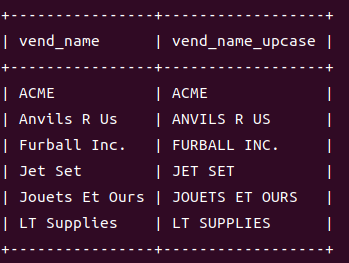

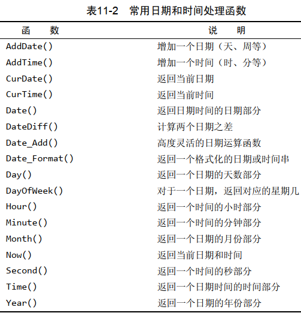

```
select order_date,cust_id,order_num from orders where order_date="2005-09-01";
```

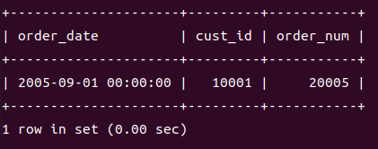

```
select order_date,cust_id,order_num from orders where date(order_date)="2005-09-01";//同上面结果，使用这个比较好
```

```
select order_date,cust_id,order_num from orders where date(order_date) between "2005-09-01" and "2005-09-30";//检索出2005年9月下的所有订单
```

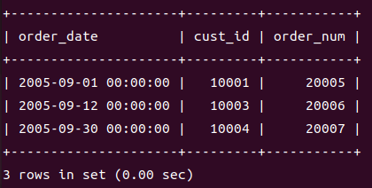

```
select order_date,cust_id,order_num from orders where year(order_date) = 2005 and month(order_date)=9;//同上面结果
```

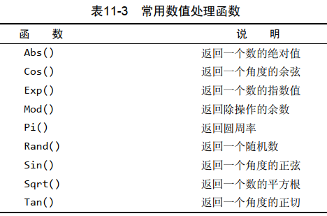

### 第 12 章  汇总表的数据  

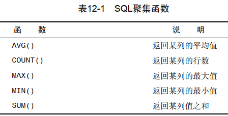

```
select avg(prod_price) as avg_price from products;
```

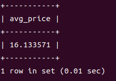

```
select avg(prod_price) as avg_price from products where vend_id=1003;
```

```
select count(*) as num_cust from customers;//行的数目进行计数， 不管表列中包含的是空值
```

```
select count(cust_email) as num_cust from customers;
```

```
select max(prod_price) as max_price from products;
```

```
select min(prod_price) as min_price from products;
```

```
select sum(quantity) as items_ordered from orderitems where order_num=20005;
```

```
select sum(quantity*item_price) as total_price from orderitems where order_num=20005;
```

```
select avg(distinct prod_price) as avg_price from products where vend_id=1003;
//平均值只考虑各个不同的价格
```

```
select count(*) as num_items,min(prod_price) as price_min,max(prod_price) as price_max,avg(prod_price) as price_avg from products;
```

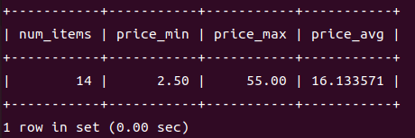

### 第 13 章  分组数据  

```
select vend_id,count(*) as num_prods from products group by vend_id;
```

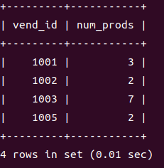

```
select vend_id,count(*) as num_prods from products group by vend_id with rollup;
```

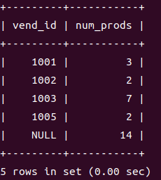

```
select vend_id,count(*) as num_prods from products group by vend_id having count(*)>=3;//WHERE过滤行，而HAVING过滤分组 
```

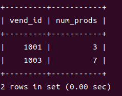

```
select vend_id,count(*) as num_prods from products where prod_price>=10 group by vend_id having count(*)>=2;
```

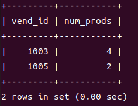

```
select vend_id,count(*) as num_prods from products group by vend_id having count(*)>=2;
```

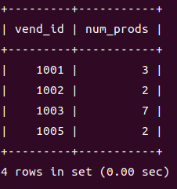

```
select order_num,sum(quantity*item_price) as ordertotal from orderitems group by order_num having sum(quantity*item_price)>=50 order by ordertotal;
```

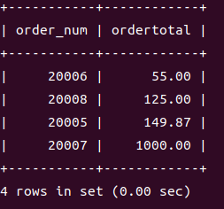

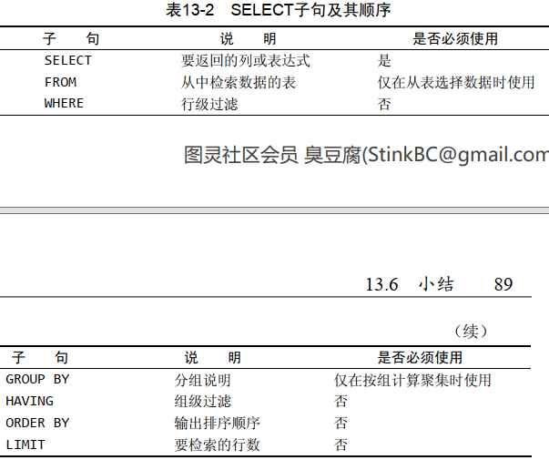

### 第 14 章  子查询  

```
select order_num from orderitems where prod_id="tnt2";
select cust_id from orders where order_num in (20005,20007);
```

上面等价于下面

```
select cust_id from orders where order_num in (select order_num from orderitems where prod_id="tnt2");
```

```
select cust_name,cust_contact from customers where cust_id in(
select cust_id from orders where order_num in(
select order_num from orderitems where prod_id="tnt2"));
```

```
select cust_name,cust_state,(select count(*) from orders where orders.cust_id = customers.cust_id) as orders from customers order by cust_name;
```

### 第 15 章  联 结 表  

```
select vend_name,prod_name,prod_price from vendors,products where vendors.vend_id=products.vend_id order by vend_name,prod_name;
```

```
select vend_name,prod_name,prod_price from vendors,products order by vend_name,prod_name;//由没有联结条件的表关系返回的结果为笛卡儿积
```

```
select vend_name,prod_name,prod_price from vendors inner join products on vendors.vend_id = products.vend_id;//使用inner join时，用on代替where
```

```
select prod_name,vend_name,prod_price,quantity from orderitems,products,vendors where products.vend_id=vendors.vend_id and orderitems.prod_id=products.prod_id and order_num=20005;
```

```
第14章
select cust_name,cust_contact from customers where cust_id in(
select cust_id from orders where order_num in(
select order_num from orderitems where prod_id="tnt2"));
可替代为
select cust_name,cust_contact from customers,orders,orderitems where customers.cust_id=orders.cust_id and orderitems.order_num=orders.order_num and prod_id="TNT2";
```

### 第 16 章  表别名和聚集函数  

```
select cust_name,cust_contact from customers as c,orders as o, orderitems as oi where c.cust_id=o.cust_id and oi.order_num=o.order_num and prod_id="tnt2";
// 表别名
```

```
select prod_id,prod_name from products where vend_id=(select vend_id from products where prod_id="dtntr");
等价
select p1.prod_id,p1.prod_name from products as p1,products as p2 where p1.vend_id=p2.vend_id and p2.prod_id="dtntr";
```

```
select c.*,o.order_num,o.order_date,oi.prod_id,oi.quantity,oi.item_price from customers as c,orders as o,orderitems as oi where c.cust_id=o.cust_id and oi.order_num=o.order_num and prod_id="fb";
```

```
select customers.cust_id,orders.order_num from customers inner join orders on customers.cust_id=orders.cust_id;
结果相等
select customers.cust_id,orders.order_num from customers, orders where customers.cust_id=orders.cust_id;
```

```
select customers.cust_id,orders.order_num from customers left outer join orders on customers.cust_id=orders.cust_id;
联结包含了那些在相关表中没有关联行的行。这种类型的联结称为外部联结
使用OUTER JOIN语法时，必须使用RIGHT或LEFT关键字
```

```
select customers.cust_name,customers.cust_id,count(orders.order_num) as num_ord from customers inner join orders on customers.cust_id=orders.cust_id group by customers.cust_id;
结果相等
select customers.cust_name,customers.cust_id,count(orders.order_num) as num_ord from customers, orders where customers.cust_id=orders.cust_id group by customers.cust_id;
```

```
select customers.cust_name,customers.cust_id,count(orders.order_num) as num_ord from customers left outer join orders on customers.cust_id=orders.cust_id group by customers.cust_id;
```

### 第 17 章   组 合 查 询使用UNION  

```
select vend_id,prod_id,prod_price from products where prod_price<=5;
```

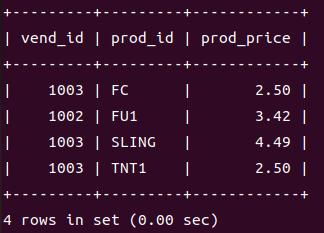

```
select vend_id,prod_id,prod_price from products where vend_id in (1001,1002);
```

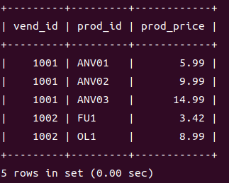

```
结合以上两条
select vend_id,prod_id,prod_price from products where prod_price<=5
union
select vend_id,prod_id,prod_price from products where vend_id in (1001,1002);
//union取消重复行，union all不取消重复的行
或
select vend_id,prod_id,prod_price from products where prod_price<=5 or vend_id in (1001,1002);
```

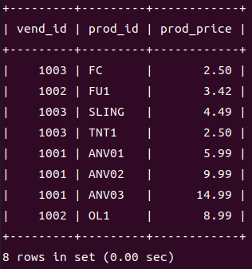

### 第 18 章  全文本搜索  

### 第 19 章  插 入 数 据  

```
show columns from customers;
```

```
insert into customers values(null,"Pep E. LaPew","100 Main Street","Los Angles","CA","90046","USA",null,null);
```

```
insert into customers(cust_name,cust_address,cust_city,cust_state,cust_zip,cust_country) values("Pep E. LaPew","100 Main Street","Los Angles","CA","90046","USA"),("M Martian","42 Galaxy Way","new York","NY","11213","USA");
插入多个行
```

```
insert into customers(cust_id,cust_contact,cust_email,cust_name,cust_address,cust_city,cust_state,cust_zip,cust_country) select cust_id,cust_contact,cust_email,cust_name,cust_address,cust_city,cust_state,cust_zip,cust_country from custnew;
从custnew中将所有数据导入customers
```

```
update customers set cust_name="the fudds",cust_email="elmer@fudd.com" where cust_id=10005;
```

```
update customers set cust_email=null where cust_id=10005;
```


```
delete from customers where cust_id=10006;
```

### 第 21 章  创建和操纵表  

```
create table customers(
cust_id int not null auto_increment,
cust_name char(50) not null,
cust_address char(50) null,
cust_city char(50) null,
cust_state char(5) null,
cust_zip char(10) null,
cust_country char(50) null,
cust_contact char(50) null,
cust_email char(255) null,
primary key(cust_id)
)engine=innodb;

//不要把NULL值与空串相混淆。 NULL值是没有值，它不是空串。如果指定''（两个单引号，其间没有字符），这在NOT NULL列中是允许的。
//使用last_insert_id()函数获得最后一个AUTO_INCREMENT值
//InnoDB是一个可靠的事务处理引擎（参见第26章），它不支持全文本搜索；
//MyISAM是一个性能极高的引擎，它支持全文本搜索（参见第18章），但不支持事务处理。
//MEMORY在功能等同于MyISAM， 但由于数据存储在内存（不是磁盘）中，速度很快（特别适合于临时表）；

```

```
alter table vendors add vend_phone char(20);
//给vendors表增加一个名为vend_phone的列
alter table vendors drop column vend_phone;
//删除刚刚添加的列vend_phone
```

```
drop table customers2;
//删除customers2表
```

```
rename table customers2 to customers;
//重命名一个表
```

### 第 22 章  使 用 视 图  

 视图用CREATE VIEW语句来创建。
 使用SHOW CREATE VIEW viewname；来查看创建视图的语句。
 用DROP删除视图，其语法为DROP VIEW viewname;。  

```
select cust_name,cust_contact from customers,orders,orderitems where customers.cust_id=orders.cust_id and orderitems.order_num=orders.order_num and prod_id="TNT2";
```

用下面两句代替

```
create view productcustomers as select cust_name,cust_contact,prod_id from customers,orders,orderitems where customers.cust_id=orders.cust_id and orderitems.order_num=orders.order_num;
//订购了任意产品的所有客户的列表
```

```
select cust_name,cust_contact from productcustomers where prod_id="tnt2";
```

```
select concat(rtrim(vend_name)," (",vend_country,")") as vend_title from vendors order by vend_name;
```

用下面两句代替

```
create view vendorlocations as select concat(rtrim(vend_name),"(",rtrim(vend_country),")") as vend_title from vendors order by vend_name;
```

```
select * from vendorlocations;
```

### 第 23 章  使用存储过程  

```
delimiter //
create procedure productpricing()
begin
	select avg(prod_price) as priceaverage
	from products;
end //
delimiter ;
//创建存储过程,DELIMITER //告诉命令行实用程序使用//作为新的语句结束分隔符
```

```
call productpricing();
```

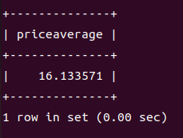

```
drop procedure productpricing;
//删除存储过程
```


```
delimiter //
create procedure productpricing(
out pl decimal(8,2),
out ph decimal(8,2),
out pa decimal(8,2)
)
begin
	select min(prod_price)
	into pl
	from products;
	select max(prod_price)
	into ph
	from products;
	select avg(prod_price)
	into pa
	from products;
end//
delimiter ;
//IN（传递给存储过程）、 OUT（从存储过程传出，如这里所用）和INOUT（对存储过程传入和传出）
```

```
//此存储过程要求3个参数，因此必须正好传递3个参数
call productpricing(@pricelow,@pricehigh,@priceaverage);
//存储过程将结果保存保存在3个变量的名字，变量都必须以@开始
select @pricehigh,@pricelow,@priceaverage;
```

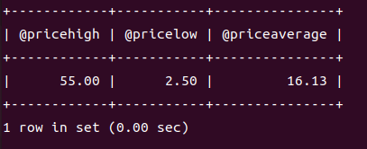


```
delimiter //
create procedure ordertotal(
in onumber int,
out ototal decimal(8,2)
)
begin
	select sum(item_price*quantity)
	from orderitems
	where order_num=onumber
	into ototal;
end//
delimiter ;
//INTO使用ototal存储计算出来的合计
```

```
call ordertotal(20005,@total);
select @total;
```

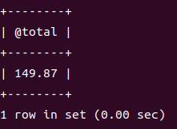


### 建立智能存储过程  

```
delimiter //
create procedure ordertotal(
in onumber int,
in taxable boolean,
out ototal decimal(8,2)
)comment "obtain order total,optionally adding tax"
begin
	declare total decimal(8,2);
	declare taxrate int default 6;
	
	select sum(item_price*quantity)
	from orderitems
	where order_num=onumber
	into total;
	
	if taxable then
		select total+(total/100*taxrate) into total;
	end if;
	
	select total into ototal;
end//
delimiter ;
```

```
call ordertotal(20005,0,@total);
select @total;
```

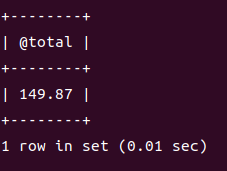

```
call ordertotal(20005,1,@total);
select @total;
```

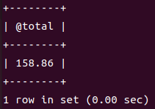

```
drop procedure ordertotal;
//删除存储过程
```

### 第 24 章 使用游标   

```
delimiter //
create procedure processorders()
begin
	declare ordernumbers cursor
	for
	select order_num from orders;
	
	open ordernumbers;
	
	close ordernumbers;
end//
delimiter ;
```

```
open ordernumbers;
```

```
close ordernumbers;
```

```
delimiter //
create procedure processorders()
begin
	declare o int;
	
	declare ordernumbers cursor
	for
	select order_num from orders;
	
	open ordernumbers;
	
	fetch ordernumbers into o;
	
	close ordernumbers;
end//
delimiter ;
```

```
delimiter //
create procedure processorders()
begin
	declare done boolean default 0;
	declare o int;
	
	declare ordernumbers cursor
	for 
	select order_num from orders;
	
	declare continue handler for sqlstate "02000" set done=1;
	
	open ordernumbers;
	repeat 
		fetch ordernumbers into o;
	until done end repeat;
	
	close ordernumbers;
end//
delimiter ;
```

```
delimiter //
create procedure processorders()
begin
	declare done boolean default 0;
	declare o int;
	declare t decimal(8,2);
	
	declare ordernumbers cursor
	for 
	select order_num from orders;
	
	declare continue handler for sqlstate "02000" set done=1;
	
	create table if not exists orsertotals
		(order_num int ,total decimal(8,2));
	open ordernumbers;
	
	repeat
		fetch ordernumbers into o;
		call ordertotal(o,1,t);
		insert into ordertotals(order_num,total)
		values(o,t);
	until done end repeat;
	close ordernumbers;
end//
delimiter ;
```

```
select * from ordertotals;
```

### 第 25 章  触发器  

```
create trigger newproducts after insert on products for each row select "Product added";
```

```
drop trigger newproduct;
```

```
create trigger neworder after insert on orders for each row select new.order_num;
insert into orders(order_date,cust_id) values(now(),10001);
```

```
delimiter //
create trigger deleteorder before delete on orders for each row
begin
	insert into archive_orders(order_num,order_date,cust_id)
	values(old.order_num,old.order_date,old.cust_id);
end//
delimiter ;
```

```
create trigger updatevendor before update on vendors
for each row set new.vend_state=upper(new.vend_state);
```

### 第 26 章  管理事务处理  

```
select * from ordertotals;
start transaction;
delete from ordertotals;
select * from ordertotals;
rollback;
select * from ordertotals;
```

```
MySQL语句都是直接针对数据库表执行和编写的,这就是所谓的隐含提交。
在事务处理块中，提交不会隐含地进行。为进行明确的提交，使用COMMIT语句
start transaction;
delete from orderitems where order_num=20010;
delete from orders where order_num=20010;
commit;
```

```
savepoint delete1;
rollback to delete1;
```

### 第 27 章  全球化和本地化  

```
show character set;
显示所有可用的字符集以及每个字符集的描述和默认校对
show collation;
显示所有可用的校对，以及它们适用的字符集
show variables like "character%";
show variables like "collation%";
确定所用的字符集和校对
```

```
给表指定字符集和校对
create table mytable
(
	columnn1 int,
	columnn2 varchar(10)
)default character set hebrew
collate hebrew_general_ci;
```

### 第 28 章  访问控制和用户管理  

```
show databases;
use mysql;
select user from user;
```

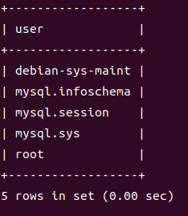

```
创建用户账号
create user ben identified by "password1";
rename user ben to bforta;
删除用户账号
drop user bforta;
查看访问权限
show grants for bforta;
```

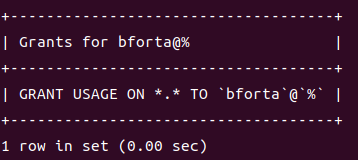

没有任何权限

```
 设置访问权限
 grant select on test.* to bforta;
 grant select,insert on test.* to bforta;
 show grants for bforta;
```

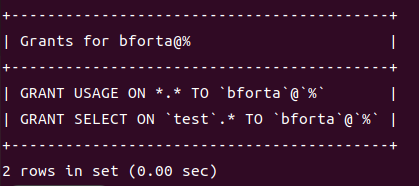

```
撤销特定的权限
revoke select on test.* from bforta;
```

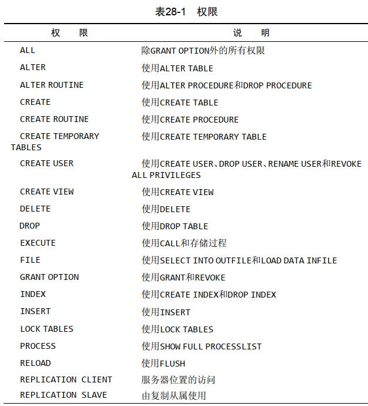

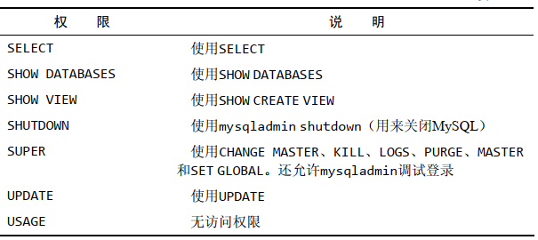

 整个服务器，使用GRANT ALL和REVOKE ALL；
 整个数据库，使用ON database.*；
 特定的表，使用ON database.table；
 特定的列；
 特定的存储过程。  

```
更改口令
set password for bforta=password("password2")
```

### 第 29 章  数据库维护  

```
analyze table orders;
```

```
check table orders,orderitems;
```


